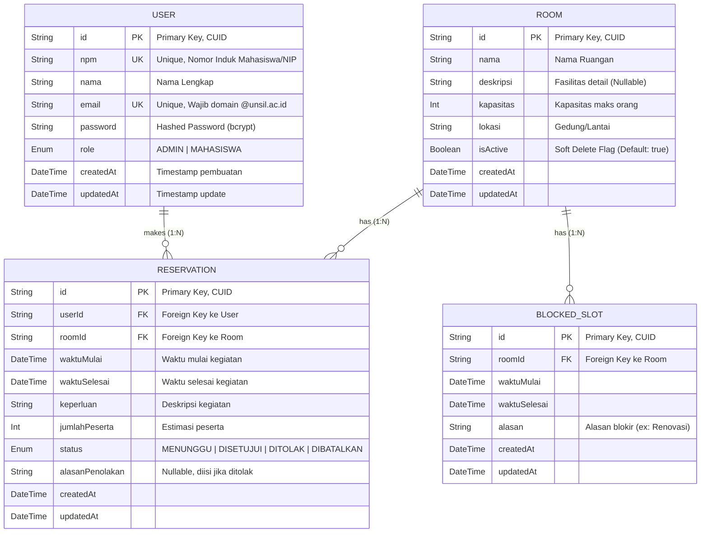

# Analisis Perancangan Basis Data: Sistem Reservasi Ruangan Kampus

## 1. Visualisasi Entity Relationship Diagram (ERD)

Diagram berikut merepresentasikan struktur basis data relasional yang dirancang untuk mendukung integritas data, efisiensi query jadwal, dan skalabilitas sistem.

---

## 2. Analisis Detail Atribut Entitas (Data Dictionary)

Bagian ini menguraikan spesifikasi atribut pada setiap entitas, termasuk tipe data dan justifikasi teknis penggunaannya dalam konteks sistem reservasi.

### A. Entitas User (Pengguna)

Entitas ini menyimpan data autentikasi dan profil pengguna sistem.

| Atribut | Tipe Data | Kendala (Constraint) | Analisis & Justifikasi Teknis |
|---------|-----------|---------------------|-------------------------------|
| `id` | String | PRIMARY KEY, CUID | Menggunakan Collision Resistant Unique Identifier (CUID) alih-alih Auto-Increment Integer untuk keamanan (tidak dapat ditebak) dan kemudahan migrasi data antar database di masa depan. |
| `npm` | String | UNIQUE | Nomor Induk Mahasiswa atau NIP. Dibuat unik untuk menjamin satu identitas akademik hanya memiliki satu akun. Tipe String dipilih untuk mengakomodasi kemungkinan karakter non-numerik atau leading zero. |
| `nama` | String | NOT NULL | Menyimpan nama lengkap pengguna untuk keperluan tampilan antarmuka dan laporan. |
| `email` | String | UNIQUE | Kunci utama autentikasi. Sistem mewajibkan validasi domain @unsil.ac.id pada level aplikasi. Kendala UNIQUE mencegah pendaftaran ganda dengan email yang sama. |
| `password` | String | NOT NULL | Menyimpan kata sandi yang telah di-hash (menggunakan algoritma seperti bcrypt atau Argon2). Panjang string disesuaikan dengan hasil hash. |
| `role` | Enum | DEFAULT: 'MAHASISWA' | Menggunakan tipe enumerasi (ADMIN, MAHASISWA) untuk membatasi nilai input dan mendukung Role-Based Access Control (RBAC) yang ketat. |

### B. Entitas Room (Ruangan/Fasilitas)

Entitas ini merepresentasikan objek fisik (sumber daya) yang dapat dipinjam.

| Atribut | Tipe Data | Kendala (Constraint) | Analisis & Justifikasi Teknis |
|---------|-----------|---------------------|-------------------------------|
| `id` | String | PRIMARY KEY, CUID | Identifikasi unik untuk setiap ruangan. |
| `nama` | String | NOT NULL | Nama ruangan (contoh: "Aula Serbaguna"). |
| `kapasitas` | Integer | NOT NULL | Digunakan untuk validasi logis. Sistem dapat menolak reservasi jika jumlahPeserta pada reservasi melebihi kapasitas ruangan. |
| `lokasi` | String | NOT NULL | Informasi lokasi fisik (Gedung/Lantai) untuk memudahkan pengguna menemukan ruangan. |
| `isActive` | Boolean | DEFAULT: true | Implementasi Soft Delete. Jika ruangan direnovasi atau tidak lagi disewakan, atribut ini diubah menjadi false alih-alih menghapus data. Ini menjaga integritas referensial data reservasi historis agar tidak hilang (yatim piatu). |

### C. Entitas Reservation (Transaksi Reservasi)

Entitas transaksional utama yang menghubungkan pengguna dengan ruangan dalam dimensi waktu.

| Atribut | Tipe Data | Kendala (Constraint) | Analisis & Justifikasi Teknis |
|---------|-----------|---------------------|-------------------------------|
| `id` | String | PRIMARY KEY, CUID | Identifikasi unik tiket reservasi. |
| `userId` | String | FOREIGN KEY | Referensi ke tabel User. Menggunakan kaidah Referential Integrity (jika user dihapus, opsi CASCADE atau SET NULL dapat diterapkan). |
| `roomId` | String | FOREIGN KEY | Referensi ke tabel Room. |
| `waktuMulai` | DateTime | INDEXED | Waktu awal penggunaan. Kolom ini wajib diindeks bersama waktuSelesai untuk mempercepat query pengecekan bentrok (conflict detection) yang akan sering dieksekusi. |
| `waktuSelesai` | DateTime | INDEXED | Waktu akhir penggunaan. |
| `status` | Enum | DEFAULT: 'MENUNGGU' | Mesin status (State Machine) reservasi: MENUNGGU (awal), DISETUJUI (final positif), DITOLAK (final negatif), DIBATALKAN (pembatalan user). |
| `alasanPenolakan` | String | NULLABLE | Atribut opsional yang hanya diisi jika Admin mengubah status menjadi DITOLAK, memberikan transparansi kepada mahasiswa. |

### D. Entitas BlockedSlot (Jadwal Blokir)

Entitas pendukung untuk manajemen ketersediaan administratif (non-reservasi).

| Atribut | Tipe Data | Kendala (Constraint) | Analisis & Justifikasi Teknis |
|---------|-----------|---------------------|-------------------------------|
| `id` | String | PRIMARY KEY, CUID | Identifikasi unik slot blokir. |
| `roomId` | String | FOREIGN KEY | Menghubungkan blokir dengan ruangan spesifik. |
| `waktuMulai` | DateTime | INDEXED | Parameter waktu untuk pengecekan ketersediaan. Memiliki prioritas lebih tinggi daripada jadwal reservasi dalam logika aplikasi. |
| `waktuSelesai` | DateTime | INDEXED | Parameter waktu akhir blokir. |
| `alasan` | String | NOT NULL | Keterangan mengapa ruangan diblokir (contoh: "Pemeliharaan AC", "Ujian Masuk"). |

---

## 3. Analisis Relasi Antar Entitas

Hubungan antar entitas dirancang untuk mencerminkan logika bisnis kampus:

### User - Reservation (One-to-Many / 1:N)

**Kardinalitas:** Satu pengguna (User) dapat membuat banyak pengajuan (Reservation), namun satu data reservasi spesifik hanya dimiliki oleh satu pengguna.

**Implikasi:** Memungkinkan sistem menampilkan "Riwayat Reservasi Saya" pada dashboard mahasiswa.

### Room - Reservation (One-to-Many / 1:N)

**Kardinalitas:** Satu ruangan (Room) dapat memiliki banyak jadwal reservasi (Reservation) yang berbeda waktu.

**Implikasi:** Memungkinkan Admin melihat kalender penggunaan untuk satu ruangan spesifik.

### Room - BlockedSlot (One-to-Many / 1:N)

**Kardinalitas:** Satu ruangan dapat memiliki banyak jadwal pemeliharaan/blokir.

**Implikasi:** Memisahkan data operasional (blokir) dari data transaksional (reservasi) menjaga kebersihan data statistik penggunaan ruangan oleh mahasiswa.